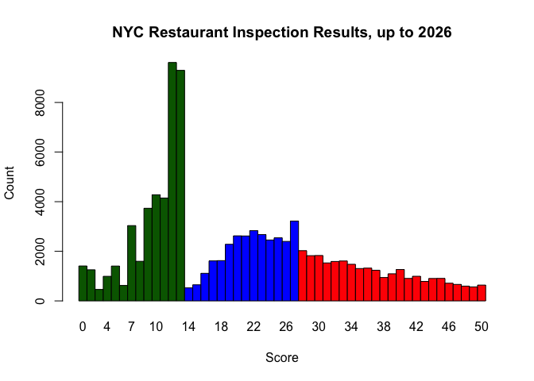
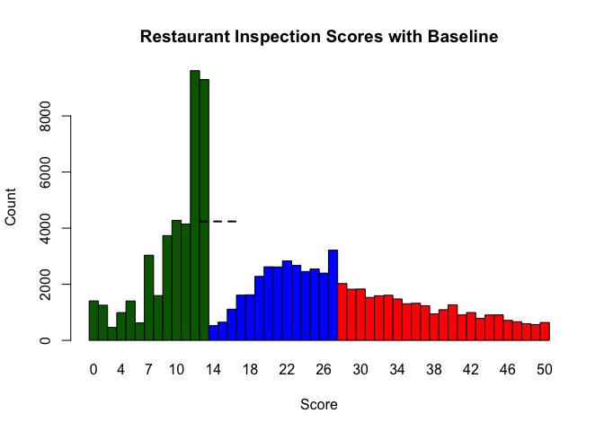
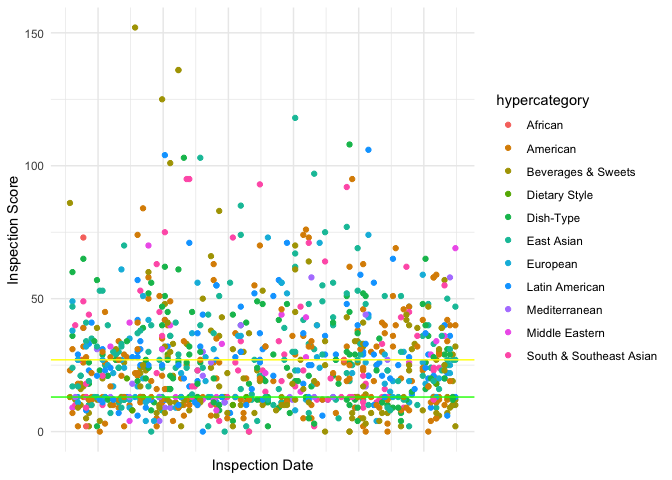

group_analysis
================

# Introduction

When choosing to dine out and explore the city’s vibrant restaurants,
many people take into consideration a variety of factors. For some, they
want to eat something they aren’t able to cook at home. For others, they
may want a more upscale experience. However, most people would consider
food safety.

Our team was inspired by an “I Quant NY”
[article](https://iquantny.tumblr.com/post/76928412519/think-nyc-restaurant-grading-is-flawed-heres).
In it, Ben Wellington points out an unnatural “peak” around a score of
13, which is at the cutoff for an “A” grade.

<figure>

<figcaption aria-hidden="true">From “Think NYC Restaurant Grading is
Flawed? Here’s the Proof,” I Quant NY</figcaption>
</figure>

Wellington’s reasoning for the unnatural peak was the subjective nature
of health inspection grading. If a restaurant were to score in the 12-15
points bucket, many health inspector may simply just assign a letter
grade of A, as it is beneficial for the local economy.

However, the data above is from 2010 - 2014, and more data is available
now.

<!-- --> So,
indeed, we notice a massive peak at the 12 and 13 score range, with a
smaller, still noticeable peak at the 28 score (the cutoff for a B
letter grade). Focusing on the A-grade bump, Wellington assumed that if
“all were fair,” there should be a fairly flat count between 12 and 16.
Adopting the same methodology, that means we would expect to see around
4000 inspections in each score bucket, assuming a “fair” distribution,
represented by the dotted black line.

<!-- --> So,
in response to Wellington’s post, the New York Health Department has
said that “inspectors are not instructed to offer leniency, just to cite
what they see.” But from a more recent, graphical analysis, we see that
the trend observed by Wellington is still present. Thus, we have three
main research questions:

1.  Is there a relationship between restaurants, boroughs and health
    inspection scores? Namely, if two restaurants of the same cuisines
    are in two different boroughs, would we expect them to receive the
    same health inspection score?
2.  If there is a relationship, are we able to accurately predict a
    restaurant’s health rating through its borough and cuisine type,
    among other predictors like median income, population, etc.
3.  For the violation codes themselves, are certain violation codes
    associated with boroughs? For example, are restaurants in Queens
    more likely to receive a violation of a certain type over another?

# Data Collection and Data Description

We primarily used two datasets, both provided through NYC’s OpenData
program. The
[first](https://data.cityofnewyork.us/Health/DOHMH-New-York-City-Restaurant-Inspection-Results/43nn-pn8j/about_data)
dataset is of the health inspections themselves. The dataset has a
variety of features, but we were mainly concern with:

1.  Borough
2.  Cuisine
3.  Score
4.  Date of inspection
5.  Violation Code

Then, because the Violation Codes by themselves are not descriptive, we
referred to an [additional data
set](https://github.com/nychealth/Food-Safety-Health-Code-Reference/blob/main/Violation-Health-Code-Mapping.csv)
that mapped a violation code to a more detailed category.

Upon an initial regression, we found that having too many categories
made our regression coefficients hard to interpret, so we decided to
group cuisines of similar types. For example, Japanese, Chinese,
Japanese/Chinese Fusion, and Korean would be grouped under “East Asian
Cuisine”

We called these groupings “hypercategories,” of which there are ten
types:

1.  American
2.  East Asian
3.  South & Southeast Asian
4.  Latin American
5.  European
6.  Mediterranean
7.  Middle Eastern
8.  African
9.  Specific Dishes (Restaurants that only do Sandwiches, Bagels,
    Crepes, etc.)
10. Dietary Specific (Vegan, Gluten-Free, Vegetarian restaurants)

Our final dataframe resembles this:

``` r
head(df %>% dplyr::select(score, borough, cuisine, hypercategory, violation_category))
```

    ##   score   borough   cuisine  hypercategory      violation_category
    ## 1    23 Manhattan   Chinese     East Asian COOLING & REFRIGERATION
    ## 2    12  Brooklyn Caribbean Latin American             HOT HOLDING
    ## 3    51 Manhattan   Chinese     East Asian COOLING & REFRIGERATION
    ## 4     0  Brooklyn   Chicken      Dish-Type                    <NA>
    ## 5    12 Manhattan  Japanese     East Asian             HOT HOLDING
    ## 6    13     Bronx   Chinese     East Asian COOLING & REFRIGERATION

## Question 1

Now for an initial exploratory analysis with graphs. Important to keep
in mind that lower scores are better.

<!-- -->
Scores on or below the green line are restaurants who earned a `A`
grade. Restaurants who scored above the green line and under the red
line are those who scored a `B` grade. Any scores above the red line
represent a `C` grade.

It may help to also see how the score distribution by cuisine. For a
clearer picture, I will take a random sample.

<!-- -->

From a quick glance, there seems to be a variety of restaurant types in
each grade bucket in our sample. Dividng each cuisine type specifically,

<!-- -->

Time for regression:

Across all boroughs, do the restaurant of the same cuisine type have the
same expected score?

``` r
fit1 <- lm(score ~ factor(borough) * factor(hypercategory),
           data = df)
```

Bronx is the baseline borough and African is the baseline hypercategory.

``` r
co <- coef(fit1)
se <- sqrt(diag(vcov(fit1)))

keep <- c("factor(borough)Brooklyn",
          "factor(borough)Manhattan",
          "factor(borough)Queens",
          "factor(borough)Staten Island")

arm::coefplot(co[keep], sds = se[keep],
              col.pts = "blue")
```

<!-- -->

Going to ignore other coefficient plots for now, becuase I don’t know
how to work it. But, I think we can do a block design ANOVA?

``` r
sample_block_design <- function(df, n_per_cell) {
  cell_counts <- df %>%
    count(hypercategory, borough, name = "n")

  insufficient <- cell_counts %>%
    filter(n < n_per_cell)
  
  if (nrow(insufficient) > 0) {
    msg <- paste0(
      "Not enough observations in the following hypercategory × borough cells:\n",
      paste0(
        "  - (", insufficient$hypercategory, ", ", insufficient$borough, 
        "): n = ", insufficient$n,
        collapse = "\n"
      )
    )
    stop(msg)
  }
  
  df %>%
    group_by(hypercategory, borough) %>%
    slice_sample(n = n_per_cell, replace = FALSE) %>%
    ungroup()
}
```

Ok, so we should probably drop Staten Island and Dietary Style, since
those are the two most sparsely populated categories.

``` r
display_anova_table(df)
```

    ##                          borough
    ## hypercategory             Bronx Brooklyn Manhattan Queens
    ##   African                   202      167       139     31
    ##   American                 1476     4588     10088   3777
    ##   Beverages & Sweets       1366     4565      6933   3904
    ##   Dish-Type                1970     3491      4434   3010
    ##   East Asian               1080     4172      5763   5491
    ##   European                  952     2035      4484   1489
    ##   Latin American           2022     4516      2235   5237
    ##   Mediterranean              50      700      1114    532
    ##   Middle Eastern            113     1511       651    516
    ##   South & Southeast Asian   220     1717      2614   2485

``` r
anova_model <- aov(score ~ hypercategory * borough, data = sampled_df)
```

``` r
summary(anova_model)
```

    ##                         Df Sum Sq Mean Sq F value   Pr(>F)    
    ## hypercategory            9  15420  1713.3   4.122 3.07e-05 ***
    ## borough                  3   2801   933.7   2.246   0.0813 .  
    ## hypercategory:borough   27  17300   640.7   1.541   0.0383 *  
    ## Residuals             1160 482194   415.7                     
    ## ---
    ## Signif. codes:  0 '***' 0.001 '**' 0.01 '*' 0.05 '.' 0.1 ' ' 1
