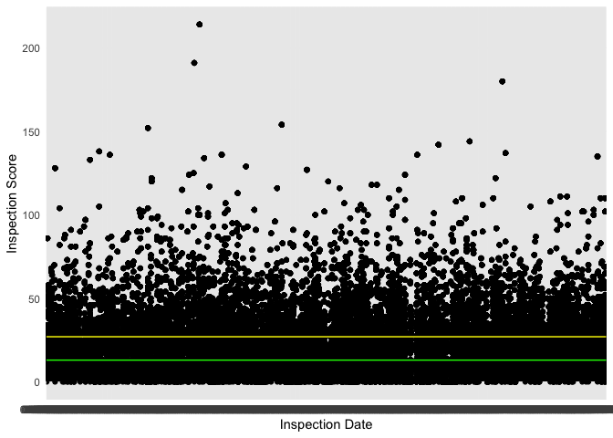
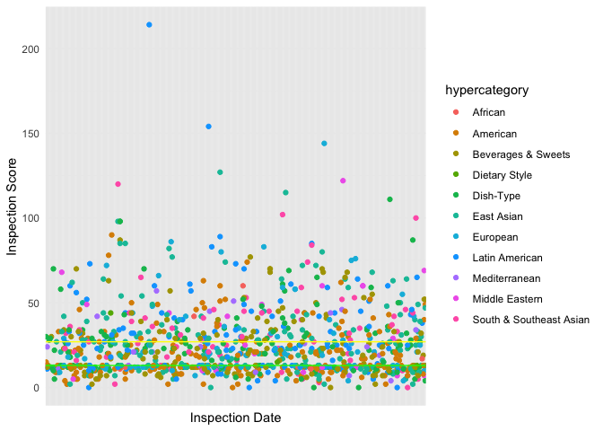
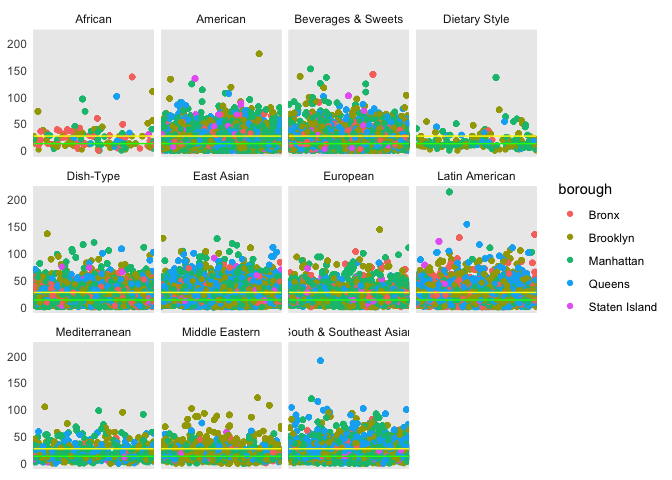
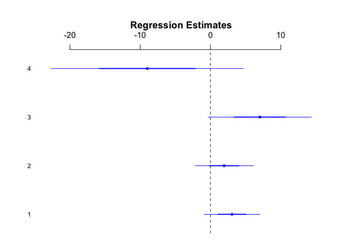

group_analysis
================

# First Research Question

One of the main things we wanted to look at is how health inspection
scores change for the same type of cuisine across different boroughs or
neighborhoods. For example, there are Greek restaurants in both
Manhattaan and Queens. Assuming the distribution of quality is similar
in both boroughs, do we expect to see a difference in health score
ratings?

## Applying Hamza’s Notes

Our dataset currently contains 90 different types of cuisines; however,
many of them can be grouped together. For example `Chinese` and
`Japanese` can be grouped together to simply be `East Asian`, especially
because there’s another group called `Chinese\Japanese`.

We can also drop some restaurants from our dataset for this research
question, as there are some restaurants who are classified as `""` and
`Not Specified / Other`. After grouping into super-groups, we now have
10 types of cuisines:

1.  American
2.  East Asian
3.  South & Southeast Asian
4.  Latin American
5.  European
6.  Mediterranean
7.  Middle Eastern
8.  African
9.  Specific Dishes (Restaurants that only do Sandwiches, Bagels,
    Crepes, etc.)
10. Dietary Specific (Vegan, Gluten-Free, Vegetarian restaurants)

Now, the data looks something like:

``` r
head(df %>% dplyr::select(score, borough, cuisine, hypercategory))
```

    ##   score   borough   cuisine  hypercategory
    ## 1    23 Manhattan   Chinese     East Asian
    ## 2    12  Brooklyn Caribbean Latin American
    ## 3    51 Manhattan   Chinese     East Asian
    ## 4     0  Brooklyn   Chicken      Dish-Type
    ## 5    12 Manhattan  Japanese     East Asian
    ## 6    13     Bronx   Chinese     East Asian

Now for an initial exploratory analysis with graphs. Important to keep
in mind that lower scores are better.

<!-- -->
Scores on or below the green line are restaurants who earned a `A`
grade. Restaurants who scored above the green line or under the yellow
line are those who scored a `B` grade. Any scores above the yellow
represent a `C` grade.

It may help to also see how the score distribution by cuisine. For a
clearer picture, I will take a random sample.

<!-- -->

From a quick glance, there seems to be a variety of restaurant types in
each grade bucket in our sample. Diving into each cuisine type
specifically,

<!-- -->

Time for regression:

Across all boroughs, do the restaurant of the same cuisine type have the
same expected score?

``` r
fit1 <- lm(score ~ factor(borough) * factor(hypercategory),
           data = df)
```

Bronx is the baseline borough and African is the baseline hypercategory.

``` r
co <- coef(fit1)
se <- sqrt(diag(vcov(fit1)))

keep <- c("factor(borough)Brooklyn",
          "factor(borough)Manhattan",
          "factor(borough)Queens",
          "factor(borough)Staten Island")

arm::coefplot(co[keep], sds = se[keep],
              col.pts = "blue")
```

<!-- -->
